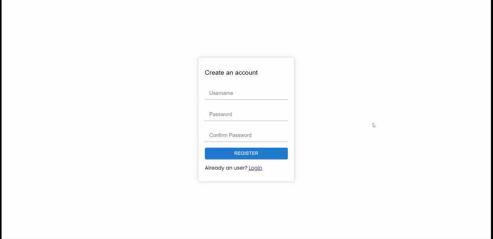
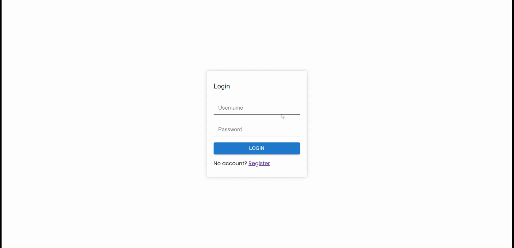
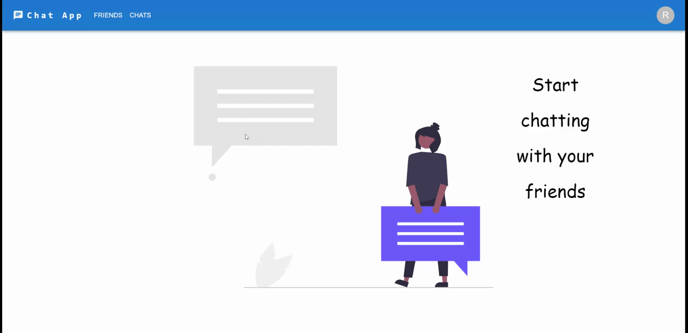
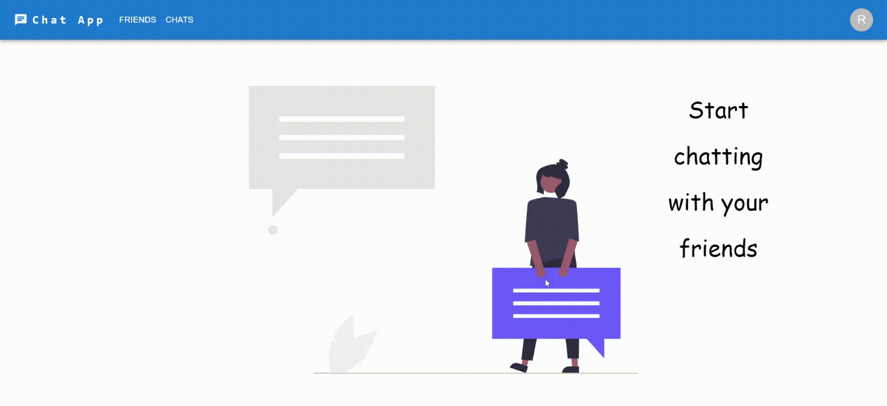
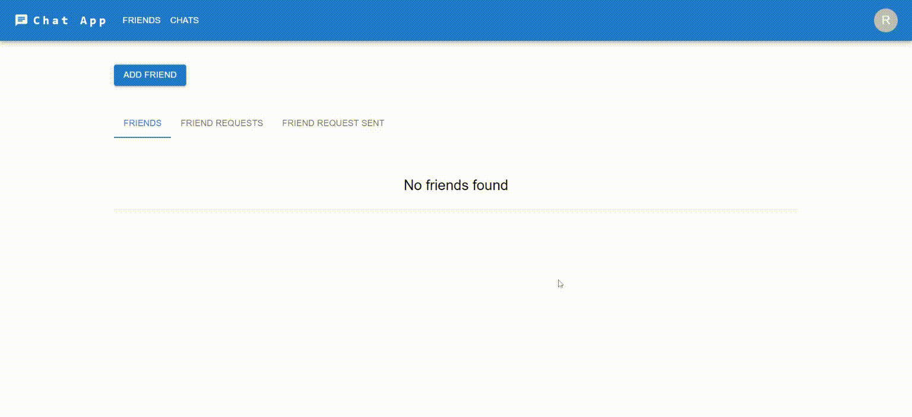
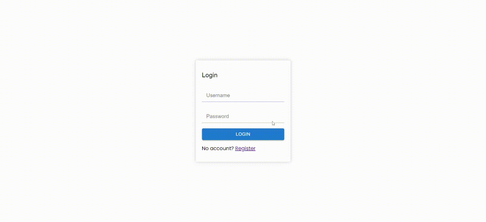
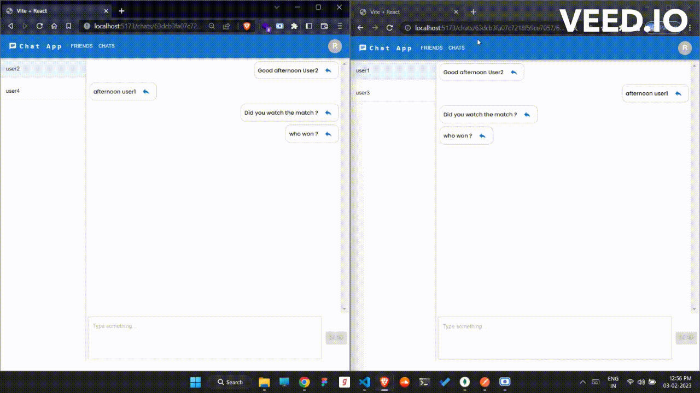

# 🔏🗨️`Private Chat Application`💬 🔏   

**_A Fullstack MERN_**
**_Realtime messaging application with websockets using Node.js, Express, MongoDB and Socket&middot;io with React.js for the frontend._**

## 📌 Features 📌

- Realtime Chat
- User Authentication
- User Authorization
- Persistent Routing and many more...

## 📌 Flow 📌

## `Registration`

## `Login`

## `Pages`

#### `Friends`

#### `Chats`

## `Sending friend request`

## `Accepting friend request`

## `Messaging`

## `Replying to a specific message`

## `Logout`

